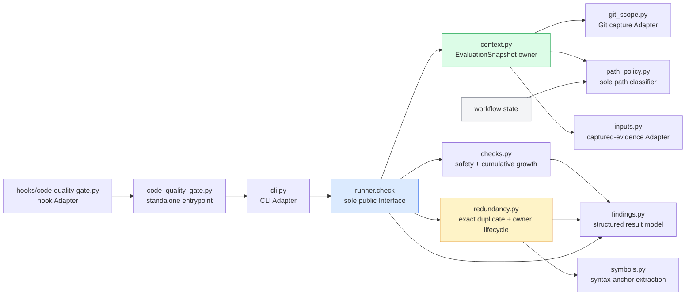

# Decision: Issue #54 quality-gate target architecture

Date: 2026-08-05. Status: proposed target state.

This document defines how the quality gate must look after issues #75, #76,
and #77 are implemented. It does not replace the sequencing and review rules
in
[`docs/plans/issue-54-quality-gate-delivery-2026-08-05.md`](../plans/issue-54-quality-gate-delivery-2026-08-05.md),
and it does not authorize any warning-to-blocker promotion. Issue #54 remains
the human calibration and promotion gate; issue #49 remains the only owner of
final-tree binding, workflow state, and persistence.

## Decision summary

The completed gate has one public Interface, one immutable evaluation owner,
one path-classification owner, one redundancy-analysis owner, and one finding
model. It deepens the existing Modules and deletes their superseded paths; it
does not add a framework above the current implementations.



Workflow state continues to call `path_policy` directly. It never imports
`EvaluationSnapshot`, a detector, or a quality-gate finding type.

## Why this shape

Two designs were considered:

1. A minimal design with direct detector functions and no shared detector
   contract.
2. A flexibility-first design with a `Detector` protocol and one class per
   rule family.

The target keeps the minimal external and file-level surface while retaining
one useful internal Seam: detector Modules return the same structured finding
and completeness types. `runner.py` calls a fixed roster in a fixed order.
There is no detector protocol, registry, dependency scheduler, plugin loader,
or caller-supplied detector list. The authorized variation is between safety,
growth, exact-duplicate, and responsibility evidence—not between runtime
implementations of a generic detector framework.

## Final Module ownership

| Module | Responsibility | Public-to-package Interface | Must not own |
|---|---|---|---|
| `runner.py` | Evaluation order, severity projection, and result serialization | `check(...) -> dict[str, object]` | Git reads, path classification, diff parsing, detector algorithms, persistence |
| `context.py` | Construct the one immutable `EvaluationSnapshot` and its complete repository index | `build_snapshot(...) -> EvaluationSnapshot` | Rule severity, warning strings, workflow state |
| `git_scope.py` | Capture one base and one candidate, including typed file states and hunk ranges | `capture_scope(...) -> GitScope` | Roles, growth policy, findings, ownership inference |
| `path_policy.py` | Classify every path once and expose the same classifier to workflow state | `classify_path(path) -> PathClassification` plus compatibility predicates derived from it | Snapshot or workflow dependencies |
| `inputs.py` | Strictly decode captured Repo Context, graph evidence, and the reserved disposition document and report malformed/incomplete input | `parse_evidence(...) -> EvidenceInputs` | Semantic authority, severity, live external calls |
| `checks.py` | Existing immediate safety checks and cumulative human-authored growth | `evaluate(snapshot) -> tuple[Finding, ...]` | Duplicate or responsibility analysis, independent path walks |
| `redundancy.py` | Exact added/retained duplication, mechanical owner candidates, dispositions, and lifecycle resolution | `analyze(snapshot) -> RedundancyReport` | Syntax extraction details, path classification, live advisor/GitNexus calls |
| `symbols.py` | Language-specific extraction of complete symbol and contiguous code anchors | `extract_anchors(path, text, hunks) -> tuple[CodeAnchor, ...]` | Name/token similarity scores, responsibility or severity decisions |
| `findings.py` | Frozen finding, region, completeness, action, lifecycle, and report types | data construction and one JSON serializer | Repository reads or detection |
| `cli.py` | Arguments, optional-input reads, text rendering, and process exit | `main()` | Result construction or policy |

The `_quality_gate` package therefore ends with ten substantive Modules, plus
the 18-line `code_quality_gate.py` standalone entrypoint. The hook Adapter
remains outside this package. Adding a
second context/snapshot Module, duplicate detector, ownership detector,
finding hierarchy, or test harness for these responsibilities violates this
decision unless the prior owner is replaced and deleted in the same slice.

## Sole external Interface

The existing call remains byte-for-byte compatible:

```python
def check(
    repo: Path,
    base_ref: str | None,
    fail_on_warnings: bool,
    repo_context_packet: str = "",
    gitnexus_context_json: str = "",
    staged_only: bool = False,
) -> dict[str, object]:
    ...
```

No `EvaluationSnapshot`, detector, filesystem port, Git client, disposition
provider, or persistence object crosses this Interface. Calibration replay
drives `runner.check` against real temporary repositories and pinned commits.

Issue #77 does not invent a seventh parameter or overload either existing
captured-evidence argument with an unrelated document. The single disposition
transport is the candidate-tree file
`.quality-gate/responsibility-dispositions.json`. Snapshot construction always
captures that exact path when it exists, even when the file itself is unchanged,
and `inputs.py` validates it before `redundancy.py` sees a typed value. The
calibration harness materializes the corpus disposition at that path in its
real temporary repository, then drives the unchanged `runner.check` Interface.

The document references exact finding/content anchors, owner surfaces, and
graph evidence; it does not claim semantic truth merely by existing in the
tree. Missing, wildcard, stale, or non-resolving references leave the candidate
active. A disposition can never clear exact deterministic conflict while both
owners remain. The gate attaches the current base/candidate identities after
validating all references, which avoids a self-referential candidate-tree hash.

## Canonical evaluation model

`context.py` replaces `GateContext` with frozen values equivalent to this
shape:

```text
EvaluationSnapshot
  baseCommit: resolved commit OID
  candidateIdentity: Git tree OID or snapshot:<sha256>
  changedScope: display-only scope description
  files: tuple[FileSnapshot, ...]
  repositoryIndex: RepositoryIndex
  growth: GrowthMetrics
  evidence: EvidenceInputs
  completeness: ScopeCompleteness

FileSnapshot
  path, role, baseText, candidateText
  addedHunks, deletedHunks
  baseAnchors, candidateAnchors

PathClassification
  role: production | test | test-support | docs | generated | vendored | unknown
  humanAuthored: bool
  source: bool
  exclusionReason: str | null
```

`test-support` contributes to the test growth bucket. Production, test, and
test-support contribute to total human-authored code. Docs, generated,
vendored, lockfile, binary, and unknown paths are reported separately and do
not silently enter a source bucket.

`path_policy.py` is also a pinned workflow-state compatibility surface. It must
remain at
`skills/production-code/scripts/_quality_gate/path_policy.py`, remain
standalone-loadable with no intra-package imports, and retain
`is_test_like_path(path)`. That predicate is derived from `classify_path`; it
does not implement a second classifier. `hooks/lib/state_store.py` continues
loading that file by path and calling that symbol without importing the
quality-gate package.

For staged evaluation, `candidateIdentity` is the captured Git tree OID. For a
working-tree evaluation, snapshot construction reads every required value
once, then hashes the ordered path, role, deletion marker, and candidate bytes.
No detector reads Git or the filesystem after construction. That digest is an
evaluation identity only; it does not duplicate issue #49's final-tree
authorization binding.

Every hunk is derived from one base-to-captured-candidate comparison. Commit,
index, dirty, and untracked deltas are not concatenated as independent diffs.
A hunk retains old/new ranges and its exact contiguous regions. Separate hunks
can never form one block.

The repository index contains the eligible base and candidate anchors needed
for retained-baseline and owner discovery. Every skipped, unreadable,
unsupported, ambiguous, or truncated file/anchor/reference is recorded. A
hard internal cap may protect execution, but reaching it changes the relevant
scope to incomplete; it can never shrink the denominator and report clean or
resolved.

## Fixed evaluation order

`runner.check` performs exactly this sequence:

```text
capture base and candidate
→ classify every path once through path_policy
→ build immutable file, hunk, anchor, growth, and completeness values
→ decode and bind supplied Repo Context / graph evidence to that identity
→ run immediate safety checks
→ evaluate cumulative growth
→ find exact added-to-added and added-to-baseline duplicates
→ use exact evidence plus captured graph/structural evidence to evaluate owners
→ validate finding identities, references, and completeness
→ separate active from resolved findings
→ derive strings and compatibility projections from the typed report
```

Detector order is a literal sequence, asserted by Interface tests. A generic
topological scheduler would add a second workflow owner without an authorized
runtime variation point.

## Rule and severity contract

The new stable rule IDs are:

| Rule ID | Meaning after all three slices | #54 severity |
|---|---|---|
| `QG54-ANALYSIS-INCOMPLETE` | Required file, owner, caller, callee, test, or test-support scope is incomplete | warning |
| `QG54-GROWTH-CUMULATIVE` | Base-to-candidate human-authored growth reaches a delivery-governance threshold | warning |
| `QG54-DUPLICATE-ADDED` | Two added regions contain the same implementation | warning |
| `QG54-DUPLICATE-BASELINE` | An added region exactly recreates retained baseline implementation | warning |
| `QG54-OWNER-COMPETITION` | Mechanical evidence identifies possible or confirmed competing owners | warning |

Immediate merge-marker, temporary-artifact, and quality-escape checks remain
separate existing blockers. The completed #54 code does not promote any ID in
the table, including when `fail_on_warnings=True`. That flag may promote only
non-`QG54-*` warnings, preserving its existing behavior for every warning that
#54 does not replace. A later promotion changes a named `QG54-*` rule policy
through a separate human-approved parent decision and, for completion-time
blocking, requires issue #49's bound final snapshot. If an affected rule is
later promoted, incomplete required analysis prevents a clean completion
verdict; that later decision must define the bound blocker projection.

Cumulative growth reports production and test/test-support additions,
deletions, and net values plus the total human-authored net. Around 500 net is
visible budget pressure and 1,000 net is blocker-eligible only after the later
binding and promotion decision. Per-file size, same-directory shrink credit,
and additive/deletion ratios are not substitutes and do not survive.

## Exact duplicate evidence

`redundancy.py` compares complete symbol/helper bodies first and contiguous
hunk-contained blocks second. Normalization removes only comments, blank
lines, and insignificant whitespace. It preserves identifiers, literals,
operators, control flow, symbol boundaries, file roles, and hunk boundaries.
Any token change means the implementations are not exact.

Every duplicate finding carries both regions. Added-to-baseline only clears
when the baseline implementation is reused or the superseded baseline region
is absent from the candidate. Added-to-added only clears when one
implementation remains or the repetition is consolidated behind one owner.
Generated code, imports, declarative tables, fixtures, and repository
boilerplate remain warning evidence only where the calibrated rule includes
their role and shape.

## Structured finding contract

`findings.py` owns one JSON shape for all #54 evidence:

```text
Finding
  ruleId: stable rule ID
  findingId: sha256(rule ID + ordered content/path anchors)
  severity: warning
  state: candidate | confirmed-unresolved | resolved | null
  baseCommit, candidateIdentity
  regions[]: path, role, start/end display lines, contentAnchor, evidenceRole
  evidence[]: typed mechanical or advisor-reviewable evidence
  completeness: required scopes and reasons
  action: reuse | deepen | replace | consolidate | delete | complete-analysis
  passCondition: typed, rerunnable predicate and referenced anchors
```

Line numbers and commit identities aid display/provenance but are excluded
from `findingId`. Unrelated inserted lines and rebases therefore preserve
identity; changing a referenced implementation changes it.

The top-level result advances to schema version 2 and adds:

```text
evaluation: base/candidate identities, role counts, growth, completeness
findings: state=null findings plus candidate/confirmed-unresolved owner findings
resolvedFindings: resolved telemetry/calibration evidence only
```

The lifecycle filter applies only to `QG54-OWNER-COMPETITION`. Findings whose
`state` is `null`—growth, exact duplicates, and analysis incompleteness—are
active whenever emitted and therefore always appear in `findings` and active
warnings. For owner findings, only `candidate` and `confirmed-unresolved` are
active.

`warnings`, `checks`, `hardRules`, `bloat`, `reuseFindings`, and
`gitnexusQueries` are derived compatibility projections from this one report,
not independently assembled truth. `resolvedFindings` never appears in active
warnings and never makes the visible gate non-green. `ok` is false only for
existing immediate blockers or an explicitly promotion-eligible rule.

## One-owner lifecycle

Names, suffixes, shared vocabulary, shared data, dependencies, and graph
proximity may generate a `candidate`; none can confirm semantic authority.
Confirmation requires exact retained implementation, provably pure forwarding
under a validated ownership contract, or snapshot-bound advisor-reviewed
evidence that supplies the responsibility key.

A confirmed finding resolves only when this complete predicate is true:

```text
responsibilityOwnerCount(responsibilityKey, role, candidateSnapshot) == 1
and every declared superseded surface is absent
and no affected caller, test, or test-support reference reaches a superseded anchor
and every affected caller, test, and test-support surface has a resolved
    reference or graph path to the surviving anchor
and owner-discovery, caller, callee, test, and test-support scope is complete
```

An unknown, skipped, stale, truncated, unresolved, or ambiguous term makes the
predicate false. The finding stays active, and
`QG54-ANALYSIS-INCOMPLETE` makes the proof gap visible. In particular, seeing
one owner before truncating ahead of a second can never yield `resolved`.

The accepted reduction paths are:

- **Deepen and absorb:** move the behavior, invariant, scenario, fixture,
  helper, or harness into the existing owner; delete the competing surface.
- **Replace:** rewire every affected caller/test/support surface to the new
  owner; delete the superseded implementation, Interface, Module, fixture,
  helper, harness, or test Module.
- **Consolidate:** move both paths behind one deeper owner; delete both
  redundant public/test surfaces.

Partial deepening, rename/move-only changes, a facade or forwarding layer over
retained owners, prose, suppressions, wildcard allowances, or a disposition
while deterministic conflict remains do not resolve the finding.
`distinct-authority` moves a `candidate` directly to resolved telemetry only
when every structural reference is snapshot-valid and the semantic evidence
is explicitly advisor-reviewable. `temporary-coexistence` stays
`confirmed-unresolved` with named old/new owners, deletion surfaces, tracked
follow-up, and expiry slice.

## Test and calibration ownership

There is one public behavior suite and one shared test-support owner:

```text
skills/production-code/scripts/
  test_code_quality_gate.py          runner.check behavior and corpus replay
  quality_gate_test_support.py       sole temp-repo, commit, run, and assertion harness
  quality_gate_corpus/
    pr68-round-six.json              captured #68 identity and expectations
    responsibility-owners.json       parent-pinned manifest, required before #77
```

The support Module is extracted once from the current test file; no test Module
reimplements Git setup, gate invocation, fixture checkout, hashing, or result
normalization. Tests may be split later only by genuinely distinct behavior,
and all must import that owner.

Every corpus entry contains an ID, exact base and candidate commits, `git diff`
SHA-256, intended positive/negative role, adjudication, and expected rule IDs.
Replay verifies identity before evaluating behavior and publishes all
candidates and false positives. The owner manifest's entries remain unknown
until parent #54 pins them; #77 cannot select, broaden, or silently replace
them.

The captured PR #68 round-six entry is fixed to:

- base `4cfffcb8d5724bfc2b03dce505da8cf930fb49fa`;
- candidate `28cf04e63fa6eb598b938d3a78d782969538d9a9`;
- `git diff` SHA-256
  `885cd0f024eedcbb3c32e80ec6a41441cb0c82e2d227335c5d43e74105973d4a`;
- human-authored code `+1129/-8`, net `1121`.

This fixture is the captured round-six corpus, not the complete PR. The merged
PR's final head has different totals.

## Mandatory consolidation and deletion

The final implementation must remove, not wrap, these superseded paths:

- `GateContext` and every raw-scope/raw-diff dictionary read outside snapshot
  construction;
- `diff_utils.py`, `collect_added_lines`, and every flattened or independent
  diff walk;
- `added_lines_with_untracked`, `production_only`, and all detector-local role
  predicates;
- the three-line duplicate windows, cross-hunk assembly, collapse heuristics,
  and their hard-failure projection;
- per-file bloat limits, same-directory shrink credit, and additive-ratio
  proxies replaced by cumulative growth;
- `reuse.py`, `ReuseFinding`, lexical behavior/name scoring, token-overlap
  severity, and silent file/symbol caps;
- behavior scoring exports from `symbols.py`; only syntax-anchor extraction
  remains;
- `RISKY_BLOCK_RULE` and `REUSE_ACTION_TOKENS`, which exist only for the
  superseded lexical reuse path and are not syntax-anchor contracts;
- `models.py` after its surviving data moves to `git_scope.py`, `context.py`,
  or `findings.py` according to the ownership table;
- parallel runner lists and hand-built error/warning/check result paths;
- obsolete helper-level tests and duplicate temp-repository/corpus harnesses.

`skills/production-code/references/gate-policy.md` and the production-code
skill guidance must be updated with the structured warning-only contract and
must stop describing lexical reuse scores or duplicate windows as blockers.

The production implementation—`code_quality_gate.py` plus `_quality_gate/*.py`—
remains under the enforced 1,800-line ceiling. The target is 1,500–1,600 lines,
honestly allowing bounded net growth from today's 1,304 lines for the new
capability while still requiring the deletions above. The budget test also
enforces 1,200 lines per Module and 180 per function, with review/justification
triggers at 700 per Module, 90 per function, and 1,200 total. This decision does
not pre-authorize a new Module or function justification: `redundancy.py` must
remain at or below 700 lines and each function at or below 90, or the owning
slice must return to parent #54 with a smaller design or an explicit reviewed
exception.

## Slice convergence map

| Slice | Target-state change | Superseded surface deleted in the same slice | End-state proof |
|---|---|---|---|
| #75 | `context.py` becomes the snapshot owner; `path_policy` supplies stored roles; `checks.py` owns cumulative growth; `runner.py` serializes one report | `GateContext`, flattened independent role walks, `production_only`, per-file/same-directory bloat proxies, parallel growth result assembly | all role consumers in `context.py`, `checks.py`, `reuse.py`, and `runner.py` read stored roles; captured #68 totals are exact; workflow state still imports only `path_policy` |
| #76 | `redundancy.py` becomes the sole exact-evidence owner across production, tests, and support | old duplicate windows, cross-hunk assembly, addition-only limitation, duplicate hard-failure path | added/added and added/baseline findings report both regions; copy-delete and consolidation clear; separate hunks cannot combine; corpus replay is identity-pinned |
| #77 | the same `redundancy.py` deepens to own responsibility candidates, dispositions, completeness, and lifecycle | `reuse.py`, `ReuseFinding`, lexical scoring/severity, silent discovery caps, parallel ownership helpers | one-owner predicate is mechanically rerunnable; truncation stays active; resolved telemetry is not an active warning; parent-pinned corpus has zero unexamined results |
| Parent #54 | human reviews named calibration results and decides whether a later promotion proposal exists | no implementation change is implied | no rule changes severity without a separate named decision; #49 remains the sole completion-binding owner |

## Completion checklist

After #77, the architecture is complete only when all of these are true:

- `runner.check` is the only public evaluation Interface and retains its six
  parameters.
- `.quality-gate/responsibility-dispositions.json` is the only disposition
  transport and every calibration disposition reaches the detector through a
  real candidate tree and `runner.check`.
- Every detector reads one frozen snapshot and no detector reads Git, disk, or
  path policy directly.
- Every quality-gate role consumer uses the snapshot's classification; workflow
  state remains independent, loads `path_policy.py` at its pinned path, and
  calls the standalone `is_test_like_path` compatibility predicate.
- Exact findings contain both hunk-preserving regions and stable IDs.
- Owner resolution proves one survivor, complete rewiring, superseded deletion,
  and complete owner/caller/callee/test/test-support scope.
- Lifecycle-less #75/#76 findings are active when emitted; only `candidate` and
  `confirmed-unresolved` owner findings are active, while `resolved` owner
  evidence is telemetry only.
- All five `QG54-*` rule IDs remain warning-only and immune to blanket
  `fail_on_warnings` promotion.
- The captured PR #68 round-six identity and totals match exactly, and the
  parent-pinned owner corpus—not an agent-selected replacement—is replayed.
- Every item in the mandatory deletion list is absent, the production package
  is no larger than 1,800 lines, and policy documentation describes the new
  owner rather than the superseded paths.
- Issue #49's CLI, event ledger, persistence, final-tree binding, and workflow
  state were not imported, changed, or reimplemented.
