# Repo Production Workflow — Visual Map

Visual aid only. [`SKILL.md`](SKILL.md) is the sequence owner;
[`INVARIANT-OWNERSHIP.md`](INVARIANT-OWNERSHIP.md) identifies every prose
owner. If this map disagrees with either, the map is defective.

Every named skill is invoked with the Skill tool. Boxes labeled **artifact** are
lead-owned, atomically written workflow evidence bound to the canonical
repository identity.

## End-to-end chain

```mermaid
flowchart LR
  subgraph C["① CONTEXT"]
    P0["begin pass state"] --> RCF["repo-context-forge\npacket artifact"]
    RCF --> D{"bug / regression / perf?"}
    D -- yes --> DG["diagnose"]
    D -- no --> GN["GitNexus packet checks"]
    DG --> GN
  end

  subgraph S["② SCOPE"]
    AD1["codex-advisor\npreflight-advice artifact"] --> G1{{"GATE 1\npass-bound advice or\naudited exception"}}
    G1 --> PF["production-preflight"]
    PF --> G2{{"GATE 2\nno material unknown"}}
  end

  subgraph B["③ BUILD"]
    TDD["tdd\nRED/GREEN captured evidence"] --> PC["production-code"]
    PC --> ST["stage exact candidate tree"]
    ST --> QE["quality artifact\nkeyed by git write-tree"]
  end

  subgraph X["④ INDEPENDENT CHECKS"]
    CR["fresh code-review\nexact-tree artifact"] --> AD2["codex-advisor\nprecommit-challenge artifact"]
    AD2 --> G3{{"GATE 3\nall artifacts match\ncandidate tree"}}
  end

  subgraph H["⑤ SHIP"]
    CM["commit → push → PR"] --> RG["reviewer completion gate"]
    RG --> G4{{"GATE 4\ncurrent-head review state"}}
    G4 --> DONE(["pass complete"])
  end

  GN --> AD1
  G2 --> TDD
  QE --> CR
  G3 --> CM
  RG -. "fix round: new named pass" .-> P0

  classDef advisor fill:#efe0fa,stroke:#6d2f9c,color:#33124d,stroke-width:3px
  classDef gate fill:#fbf1de,stroke:#a86c17,color:#4a3008,stroke-width:2px
  classDef step fill:#e2efee,stroke:#20605f,color:#123433
  classDef done fill:#e3f2e8,stroke:#2c6b46,color:#123420
  class AD1,AD2 advisor
  class G1,G2,G3,G4 gate
  class P0,RCF,DG,GN,PF,TDD,PC,ST,QE,CR,CM,RG step
  class DONE done
```



## Invocation and artifact table

| Step | Invocation | Durable evidence |
|---|---|---|
| Pass | `pass-state.py begin` | `pass-<slug>.json` |
| Context | `repo-context-forge` + `bootstrap.py --workflow-slug` | packet + `repoforge.json` |
| Diagnose | `diagnose` when applicable | traced hypothesis in pass/report |
| Graph | packet-scoped GitNexus MCP tools | caller-supplied context/impact file when persisted |
| Advice | `codex-advisor`, `preflight-advice` | structured pass-bound attestation or audited exception |
| Preflight | `production-preflight` | lead preflight + continuously updated pass state |
| TDD | `tdd` + `tdd-run` | RED/GREEN JSONL, explicitly not chronology proof |
| Implement | `production-code` | changed tree |
| Quality | `record_quality_evidence.py --mode commit` | `quality-<index-tree>.json` |
| Review | fresh `code-review` + lead recorder | `review-<slug>-<index-tree>.json` |
| Challenge | `codex-advisor`, `precommit-challenge` | exact-tree advisor attestation |
| Ship | Git and reviewer loop | PR/current-head reviewer state |

## Ownership pointers

- Canonical mock-ban, imaginary-risk, and root-cause-first statements:
  `~/.claude/CLAUDE.md`.
- Isolated advisor-delegate copy: `codex-advisor` wrapper only.
- GitNexus doctrine: `~/.claude/CLAUDE.md` §9.
- Advisor transport: `codex-advisor/SKILL.md` and its wrapper.
- Transaction doctrine: `production-code/references/transaction-doctrine.md`.
- Seven quality principles: `code-quality/SKILL.md`.

This map deliberately does not repeat those contracts; duplicated policy text creates avoidable drift.

## Artifact invalidation

Any staged change after quality, review, or challenge invalidates every later
artifact because the index tree changes:

```text
stage candidate
  → quality evidence
  → fresh review artifact (non-trivial)
  → advisor challenge (non-trivial)
  → commit
```

Repeat from `stage candidate` after a fix. Writer and reader derive the
repository key through the same canonical helper; local digest
reimplementations are forbidden.

## Hook behavior

- One Bash PreToolUse shell hook keeps the non-Git fast bail, starts one Python
  interpreter for relevant commands, classifies once, and applies two policy
  branches.
- Edit/Write/NotebookEdit PreToolUse requires packet, GitNexus, and preflight
  evidence for production code paths.
- PostToolUse records a non-authorizing quality observation and blocks on a
  real quality failure.
- PreCompact flushes existing pass state only.
- SessionStart re-arms the whole chain and a bounded pass summary.
- Stop emits structured, non-blocking blast-radius/reviewer context; unavailable
  checks are `unknown`, never green.

See `SKILL.md` for the exact failure-open and failure-closed map.
