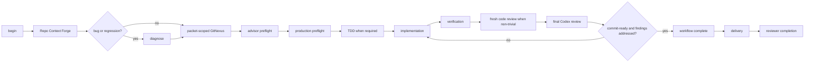

# Production workflow map

The maintained boundary is workflow sequencing and completion. Git remains an
ordinary delivery tool.



## State Interface

One repository-scoped file records the active slug, phase, next action, step
statuses, code-review disposition state, and final-review result.

```text
begin
set-phase
advisor-result
complete
summary
```

The state file is atomic, private, and agent-writable. It provides continuity
after compaction; it is not tamper-proof and does not authorize Git. A normal
commit or HEAD change does not invalidate it.

`complete` requires:

- Repo Context Forge and GitNexus completed;
- advisor preflight completed or explicitly unavailable;
- production preflight completed;
- TDD passed or not required;
- implementation and verification passed;
- code review passed/not required with material findings addressed;
- final review from `codex-agent` or `codex-advisor` with `commit-ready` and no
  pending material findings.

## Edit invalidation

```text
production Edit/Write/NotebookEdit
  -> implementation = in-progress
  -> verification = pending
  -> codeReview = pending
  -> finalReview = pending
  -> nextAction = verification
```

Invalidation occurs before quality feedback, so a failing quality check cannot
leave stale readiness behind. Documentation and scratch edits are exempt.

## Hook roles

| Hook | Role |
|---|---|
| `PreToolUse(Edit\|Write\|NotebookEdit)` | Require the recorded before-edit sequence through production preflight |
| `PostToolUse(Edit\|Write\|NotebookEdit)` | Invalidate downstream readiness, then return quality feedback |
| `PreCompact(manual\|auto)` | Atomically flush existing state without advancing it |
| `SessionStart(compact\|resume)` | Restore the full workflow chain and bounded current summary |
| `Stop` | Return non-blocking changed-file and caller/callee context; unavailable checks are `unknown` |

There is no Bash command matcher, Git hook, command classifier, protected-path
parser, candidate-tree gate, approval marker, nonce, or evidence graph.

## Ordinary summaries

Repo Context Forge output, TDD runs, and code-review findings may be retained as
bounded summaries for the next agent. They carry no HEAD/tree/hash identity and
are never substitutes for the real packet, test command, or live review.

## Delivery is separate

Workflow completion means the production process reached a final ready review.
Commit, push, PR creation, CI, reviewer comments, and mergeability remain normal
delivery/reviewer-loop concerns after that point.
