# Production workflow map

The maintained boundary is workflow sequencing and completion. Git remains an
ordinary delivery tool.

```mermaid
flowchart LR
    B[begin] --> R[Repo Context Forge records the packet graph evidence]
    R --> D{bug or regression?}
    D -->|yes| DG[diagnose]
    D -->|no| A1[advisor preflight]
    DG --> A1
    A1 --> P[production preflight records the Behavior Map]
    P --> M{map has a pending item?}
    M -->|yes| TR[mapped contract RED, preservation items settled first]
    M -->|no: every item already-satisfied or omitted| NR[tdd --not-required]
    TR --> PC[production-code]
    NR --> PC
    PC --> I[implementation]
    I -->|active RED| TG[mapped GREEN]
    I -->|co-satisfied pending contract| TP[post-edit pass]
    I -->|not-required map| V
    TG --> TM[post-proof map reassessment]
    TP --> TM
    TM -->|new obligation| TR
    TM -->|map resolved| V[verification]
    V --> CR[lead structured code review when non-trivial]
    CR --> A2[independent final Codex Advisor review]
    A2 --> C{commit-ready and findings addressed?}
    C -->|behavioral finding| TM2[tdd-map adds the item]
    TM2 --> TR
    C -->|non-behavioral finding| I
    C -->|yes| WC[workflow complete]
    WC --> DL[delivery]
    DL --> PR[reviewer completion]
```



## State Interface

One repository-scoped SQLite event ledger records accepted transitions, logical evidence, review manifests, and complete canonical resulting state. A disposable projection names the active workflow and latest event; reads repair it from the ledger when it is missing, dangling, or stale. See [Workflow state root](https://github.com/future3OOO/claude-skills/blob/main/README.md#workflow-state-root) for which root holds it.

```text
workflow begin                 # assigns and activates a random workflowId
workflow status|summary        # active canonical state
workflow history               # ordered accepted events and logical references
workflow evidence              # read one logical evidence record
workflow set-phase             # lead-owned implementation and trivial review
workflow record-preflight      # validates 13 text sections + Behavior Map
workflow record-production-code # validates the bundled gate verdict
workflow tdd                   # mapped RED/GREEN, post-edit pass, or not-required
workflow tdd-map               # dispositions and post-proof map updates
workflow verify                # generic commands or typed final-tree quality gate
workflow record-review         # structured lead review plus tree manifest
workflow advisor-result|advisor-disposition
workflow pause|checkpoint|complete|prune
```

### `workflow status` contract

`workflow status` is a public JSON Interface, not a dump of persistence internals.
It returns the active canonical `schemaVersion: 1` projection. Callers may rely
on the semantic workflow fields: repository identity, `slug`, `workflowId`,
`phase`, `nextAction`, phase statuses, advisor/review records, logical evidence
identities, and the optional `paused` and `revalidation` state. The projection
never includes a database path, SQLite table or column name, journal detail, or
other storage mechanism. With no authoritative workflow it prints no JSON,
returns exit 2, names `no active workflow`, and creates no state.

Repo Context Forge, preflight, production-code, TDD, verification, review, and
addressed advisor dispositions record only with their native validated documents
as logical evidence, inserted in the same SQLite transaction as the accepted event; a
findings-none advisor disposition intentionally carries no document, and a
refusal names the missing evidence and mutates nothing. The preflight document
owns the initial Behavior Map; mapped TDD evidence carries its stable IDs,
RED/GREEN and post-edit pass runs, current dispositions, and pending reassessment. A plan may show
the map but is not an evidence owner.

Exit 2 alone does not prove a refusal: the verification, TDD, and review
producers each document a path that commits first and returns 2 after — a
command that failed after being recorded, an invalid TDD run recorded as
`reopen` or `in-progress`, and a review whose material findings remain
unresolved. Repo Context Forge, preflight, production-code, and verification keep their
accepted reference only while producer-recorded as passed — every other transition drops
it, so a bare replay can never resurrect prior evidence. TDD and code review
instead keep a current producer reference across their own non-passed states —
TDD while in-progress and when not-required, code review while pending — so a
later run can validate or supersede it. Only TDD's in-progress reference serves
GREEN's validation of the RED it follows. A `post-edit-passed` run instead requires
a prior producer-counted cycle, dirty production candidate, settled cycle and
reassessment, pending contract item, and directly invoked pytest or unittest
terminal pass; it does not claim item-specific RED history. TDD entry demands
recorded preflight evidence and, for new governed passes, a mapped behavior ID. Each producer stamps
the workflow instance into its evidence and the ledger keeps its logical
identity, so a passed Repo Context Forge, preflight, production-code, or
verification phase without one — legacy state, or a bare library claim — reads
pending at completion, never success. Evidence proves the output exists, not
that the analysis is good; fabrication remains deception and stays covered by
the transcript audit.

The database and its containing directory are private and agent-writable. Committed transactions provide continuity across process restart and compaction; it is not tamper-proof and does not authorize Git. A normal
commit or HEAD change does not invalidate it. After production preflight,
test-like edits are admitted while TDD is pending. Production edits are admitted
after the production-code baseline for an active valid mapped RED, a fully
dispositioned `not-required` map, or a resolved and reassessed proof map. GREEN and
`post-edit-passed` each block the next production edit until `tdd-map` records the
required architecture, preservation, and interaction reassessment. A later edit against a resolved map
stays admitted but flags completion for another reassessment. A normally
completed workflow is terminal: every mutation except `begin` is rejected.

A governance-document edit after completion is the sole controlled revalidation exception: it opens a window in
which only verification, code review, the final advisor review, and completion
are accepted, production editing stays closed, and completing again restores
the terminal state. The read-only `checkpoint` query reports consult
readiness for the advisor phases without mutating anything.

### Finding lifecycle

A material final-review finding the lead closes itself opens one appeal, bound to
that finding, its immutable intake, and the candidate tree the closure measured.
Only a strict advisor envelope answers it: a bare recorded verdict carries no
findings intake, so its silence is not the advisor omitting the appealed id.
Omission in the next context-matched envelope accepts the closure and terminalizes
it, whatever else that envelope raises; a material re-raise of the same id records
persistent disagreement and blocks completion with
`needs-human-owner-adjudication`, which ordinary progress does not clear. The
answer records whether it reviewed the bound candidate, so a stale acceptance
stays auditable without the appeal becoming unanswerable when the pass corrects
something else. A `context-mismatch` envelope answers nothing, consumes no
appeal, and contributes no findings, while remaining recorded as evidence.

One recorded envelope is one correction batch. While a stage-final finding is
unresolved or a review-stage reservation is not both consumed and fixed,
`nextAction` names the correction the batch owes - `tdd` for an open reservation,
otherwise `address-review-findings` - and never generic verification, the typed
gate, or lead review. The batch is keyed on the immutable intake, so a correction
edit does not close it.

A closure document references only the findings it changes; untouched terminal
findings stay terminal without being re-copied. An erroneous settled record,
including one carrying a consumed proof reservation, is corrected only by an
appended supersession naming what it replaces and why - never by rewriting
history, and never on a record that has settled nothing.

### Pass identity

`baseOid` is the immutable integration fork point recorded by the Repo Context
Forge adapter, and remains the only base the per-edit quality gate receives.
`passStartOid` is the commit at `begin`, recorded first-write-wins and honestly
absent when HEAD does not resolve; it does not move when a local candidate commit
changes HEAD. A local commit is a reversible snapshot, not publication.

`complete` requires:

- Repo Context Forge completed, carrying its producer graph evidence;
- advisor preflight completed with findings dispositioned, or explicitly
  unavailable with a measured reason;
- production preflight completed with a non-empty Behavior Map;
- every contract map item GREEN, `post-edit-passed`, or `already-satisfied` by the recorder's own baseline run (its exact mapped surface passed before any edit);
- every preservation map item GREEN, already satisfied, or omitted with evidence (the recorder validates the evidence structurally; its truth is a lead-owned obligation the reviews check) - a superseded item of either kind instead needs a GREEN or `post-edit-passed` terminal replacement - judged by `behavior_map` inside `complete()`'s transaction;
- no pending proof gap or post-proof map reassessment;
- TDD passed or not required;
- production-code recorded;
- implementation and verification passed;
- preflight, production-code, and verification each carrying their producer's
  evidence reference;
- lead code review passed/not required with material findings addressed;
- final review from `codex-advisor` with `commit-ready` and no pending material
  findings, no appeal still awaiting a strict envelope, and no recorded
  persistent disagreement;
- the reviewable working tree unchanged since the recorded lead review.

The historical `pass-state.py`, recorder, TDD, and verification scripts are temporary compatibility adapters. They call the same unified CLI Module and contain no persistence or path logic; new callers use `workflow.py` directly.

## Edit invalidation

```text
production Edit/Write/NotebookEdit
  -> implementation = in-progress
  -> verification = pending
  -> codeReview = pending
  -> finalReview = pending
  -> nextAction = implementation
```

Invalidation occurs before quality feedback, so a failing quality check cannot
leave stale readiness behind. Ordinary documentation and scratch edits are
exempt; governance docs reset verification, code review, and final review, and
resume at the first unsatisfied phase in the same ordered workflow. A
governance-first pass therefore returns to TDD, while a completed
implementation returns to verification.

Behavioral findings from the lead's code review or final Codex Advisor against the current unpushed tree return to mapped TDD under the active `workflowId`: add the Behavior Map item, drive its behavior-specific RED, then fix it. Only genuinely non-behavioral corrections return directly to implementation, with the reason recorded. The behavioral/non-behavioral classification is a lead-owned obligation, not a machine-validated edge: the recorder validates the reassessment's structure and blocks completion until one is recorded, but it cannot judge the classification itself - a behavioral defect routed through a why-only reassessment is a doctrine violation the reviews are expected to catch, not a state the hooks can refuse. A legitimate reviewer signal on a pushed PR head, or a bug/regression outside the active workflow intent, instead starts a new workflow with `begin`.

## Approval freshness

A file written through the shell emits no editor event, so nothing invalidates
mid-stream, and the pre-edit gate does not see that write either — an accepted
gap, because the failure model is drift rather than deception. Freshness is
recovered at the later gates instead. Recording the lead review stores a
per-path manifest of the reviewable surface: each path's working-tree file mode
and content hash, and for a tracked submodule the commit it currently points at.
The index is read only to learn which paths are tracked and which of them are
submodules; every recorded value comes from the working tree, never from an
index object id, which records staged content and would miss an unstaged edit.
Four things follow from that: the bytes are hashed unfiltered, so a normalising
clean filter cannot hide a line-ending rewrite; the mode rides along — git's owner
execute bit, the only one a tree entry records — because a content hash alone
is blind to `chmod`; a symlink is recorded as the link rather
than its referent, so re-pointing one is visible and a file outside the
repository can never drift the manifest; and a submodule is read from its own
checked-out `HEAD`, so an unstaged submodule move is visible. A submodule is
recorded by that commit alone: uncommitted content inside it belongs to that
repository's own review, not this one's. Each later gate recomputes it:

```text
final advisor recording refuses -> the tree changed after the lead review
final-review checkpoint reports not ready -> same, before a paid consult is spent
complete refuses -> the tree changed after the final review
```

The refusal site is the window attribution, and every refusal names the added,
changed, and removed paths. Re-recording the lead review refreshes the manifest
and resets the final review to pending, so a refreshed tree always costs a fresh
final consult. A missing or uncomputable manifest is pending, never success: a
pass in flight when this shipped cannot complete until its lead review is
re-recorded. A mutation racing the completion call itself stays uncatchable —
the state lock serializes state writers, not the filesystem.

## Hook roles

This section is the canonical operational documentation for hook behavior.
`~/.claude/settings.json` and the hook scripts remain the executable Interface:
where they disagree with this table, the code is correct and the table is the
defect. `CLAUDE.md` §9 keeps only the facts that change lead action each
session and defers the rest here.

| Hook | Role |
|---|---|
| `PreToolUse(Edit\|Write\|NotebookEdit)` | Require recorded preflight; admit test-like edits while TDD is pending; after the production-code baseline admit production edits for an active valid mapped RED, a fully dispositioned `not-required` map, or a resolved/reassessed proof map; after GREEN or `post-edit-passed` block the next production edit until map reassessment |
| `PostToolUse(Edit\|Write\|NotebookEdit)` | Invalidate downstream readiness, record the session's repository association where a pass exists, then return quality feedback — the gate run carries the pass's recorded base OID as `--base-ref` when bootstrap recorded one, so growth warnings read branch-cumulative per edit; with no recorded base the hook derives nothing and the gate reports the base-binding gap |
| `SessionStart(compact\|resume)` | Restore the full workflow chain and bounded current summary from committed SQLite state |
| `Stop` | Completion latch plus context: blocks with the exact `nextAction` while canonical completion readiness reports missing work and no pause is recorded; authoritative workflow or mapped-evidence corruption remains repair-only and cannot be released by `pause`. It permits stopping for ready workflows, terminal-complete passes without an open revalidation window (PRD #30's pending-reading covers legacy in-flight passes only), non-empty `background_tasks`/`session_crons` in the real Stop payload, recorded instance-bound waits for ordinary external blockers, advisor delegates, and a hook-triggered re-stop with no workflow progress since the previous block — that repeat is a bare silent success because any Stop output re-prompts the model. Every latch firing and outcome is appended to `stop-latch-log.jsonl` in the repository state directory (`latched`/`spun`/`resolved` with how), so the latch's cost/benefit question resolves on data. `cwd-suppressed` is also appended there and counts one selection event, not a firing or outcome |

`Stop` consults the workflows the session actually edited in, not the directory
it was launched from. `PostToolUse` records one immutable marker per repository
per session under `sessions/<session>/<repo-key>.json` in the state root,
written only where a workflow already exists, and identity comes from the edited
path through the same resolver the edit gate uses — no hook gains Git awareness,
and a storage failure only prints to stderr, never changing a hook's exit
status, its review invalidation, or the quality gate it runs. Those associations
replace the candidate set rather than extending it: the session `cwd` slot is
consulted only by a session that recorded no association at all, whose behaviour
is unchanged. A payload whose `session_id` is missing, null, not a string, empty,
or only whitespace belongs to no session: it is rejected before any key is
derived, so it records no association and reads none, and therefore keeps that
`cwd` fallback — the association key is never defaulted to a shared literal,
because every anonymous payload would then share one identity and one
repository's pass could reach another's Stop.

For an admitted non-blank string id the key is `safe_slug(session_id)[:40]`, and
that transform is lossy rather than injective. In order it trims surrounding
whitespace, replaces each run of characters outside `[A-Za-z0-9._-]` with a
single `-`, strips leading and trailing `-`, `.` and `_`, lowercases, caps at 80
characters, substitutes the literal `unnamed-workflow` when nothing survives, and
is then cut to 40. Distinct ids therefore **can** collide — by case, by any
character outside that allowed set (`.`, `_` and internal `-` are preserved), by
edge characters alone, beyond 40 characters, and, for non-blank ids whose whole
content is removed by that replacement and edge stripping, on the
`unnamed-workflow` literal itself. A blank id never reaches this transform at
all; it is refused by the admission check above.

Per-session isolation is thus a property of the ids this harness supplies, not a
guarantee of the key: they are lowercase hexadecimal UUIDs and so are fixed
points of the whole transform — measured across 644 recorded sessions, none
altered by it and none sharing a key. Any future id source must be injective
under the transform exactly as written above, or introduce a collision-resistant
encoding here before it is trusted. The repository-scoped per-session feedback file and the
latch telemetry keep their own `unknown` display name, which cannot cross
repositories.

That rule has a price, and it is the reason a `cwd-suppressed` event exists. Once
a session records any marker, its `cwd` slot is never consulted again, so a pass
**begun or inherited at `cwd` and never edited by this session goes unwatched
until its first file write** — it cannot latch, and it is not reported. The
baseline behaviour was to latch it. Both cases are indistinguishable at the hook:
this session's own unedited `cwd` pass and another session's incomplete `cwd`
pass present the same terminal-marker-plus-incomplete-`cwd` state, and no
predicate over markers and workflow contents separates them, so the suppression
is deliberate rather than an oversight. It is counted rather than only accepted,
because the payload's `cwd` reaches no state file and an audit after the fact
could never recover which slot was passed over. No hook retires markers. The
deliberate `prune` verb (issue #50) retires one only when its recorded
repository root is confirmed absent: a session stripped of every marker does
return to the `cwd` slot, but only when each of its repositories is gone,
where that slot resolves no pass either.

**Release note — the latch telemetry population changed.** Events now carry the
`repo` key of the slot they fired against, and the population they describe has
moved: it gains worktree sessions the hook previously never visited and loses
firings against unrelated session-`cwd` slots. Counts recorded before and after
this change are not comparable, and any earlier conclusion about the latch's
value was drawn from firings against session-directory slots rather than the
passes actually being run.

After latch handling, the ordinary feedback path emits bounded context
containing changed-code status and the workflow summary per consulted slot, and
deduplicates identical rendered context per session and slot. When Git reports
no changed code and no workflow state exists, that path emits nothing. The
payload it reads was captured on Claude Code 2.1.220 and is kept as a test
fixture; the delegate release is the `CODEX_ADVISOR_ACTIVE` environment
variable.

There is no Bash command matcher, Git hook, command classifier, protected-path
parser, candidate-tree gate, approval marker, nonce, or evidence graph.

## Ordinary summaries

Repo Context Forge output, mapped TDD runs/reassessments, and code-review
findings may be retained as bounded summaries for the next agent. They carry no
HEAD/tree/hash identity and are never substitutes for the real packet, recorded
Behavior Map, test command, or live review. The review-time manifest above is
workflow state rather than one of these summaries, and it identifies working-tree
file mode and content, plus each submodule's checked-out commit — never this
repository's own HEAD, and never an attestation.

## Delivery is separate

Workflow completion means the production process reached a final ready review.
Delivery follows only when integration is intended; the no-PR route (local-only
work, estate syncs, work the user said not to push) completes the workflow,
reports the change and its verification, and names why no PR exists.
Commit, push, PR creation, CI, reviewer comments, and mergeability remain normal
delivery/reviewer-loop concerns after that point.
