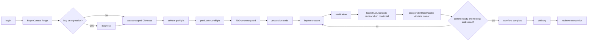

# Production workflow map

The maintained boundary is workflow sequencing and completion. Git remains an
ordinary delivery tool.



## State Interface

One repository-scoped file records the active slug, phase, next action, step
statuses, code-review disposition state, and final-review result.

```text
begin              # assigns the pass's random workflowId
set-phase          # lead-owned step recording (ordered; --slug/--workflow-id
                   # optional, and validated against the active instance)
advisor-result     # producer-recorded raw consult, slug + workflowId bound
advisor-disposition  # lead-owned findings disposition, instance bound
pause              # instance-bound honest wait; releases the Stop latch
checkpoint         # read-only consult readiness for the advisor phases
complete           # terminal; same optional instance check; only begin
                   # starts another pass
summary
status
```

The state file is atomic, private, and agent-writable. It provides continuity
after compaction; it is not tamper-proof and does not authorize Git. A normal
commit or HEAD change does not invalidate it. After production preflight,
test-like edits are admitted while TDD is pending; production edits stay
blocked until a valid RED or a recorded not-required decision. A normally
completed workflow is terminal: every mutation except `begin` is rejected.
A governance-document edit after
completion is the sole controlled revalidation exception: it opens a window in
which only verification, code review, the final advisor review, and completion
are accepted, production editing stays closed, and completing again restores
the terminal state. The read-only `checkpoint` query reports consult
readiness for the advisor phases without mutating anything.

`complete` requires:

- Repo Context Forge and GitNexus completed;
- advisor preflight completed with findings dispositioned, or explicitly
  unavailable with a measured reason;
- production preflight completed;
- TDD passed or not required;
- production-code recorded;
- implementation and verification passed;
- lead code review passed/not required with material findings addressed;
- final review from `codex-advisor` with `commit-ready` and no pending material
  findings;
- the reviewable working tree unchanged since the recorded lead review.

## Edit invalidation

```text
production Edit/Write/NotebookEdit
  -> implementation = in-progress
  -> verification = pending
  -> codeReview = pending
  -> finalReview = pending
  -> nextAction = implementation
```

Invalidation occurs before quality feedback, so a failing quality check cannot
leave stale readiness behind. Ordinary documentation and scratch edits are
exempt; governance docs reset verification, code review, and final review, and
resume at the first unsatisfied phase in the same ordered workflow. A
governance-first pass therefore returns to TDD, while a completed
implementation returns to verification.

## Approval freshness

A file written through the shell emits no editor event, so nothing invalidates
mid-stream, and the pre-edit gate does not see that write either — an accepted
gap, because the failure model is drift rather than deception. Freshness is
recovered at the later gates instead. Recording the lead review stores a
per-path manifest of the reviewable surface: each path's working-tree file mode
and content hash, and for a tracked submodule the commit it currently points at.
The index is read only to learn which paths are tracked and which of them are
submodules; every recorded value comes from the working tree, never from an
index object id, which records staged content and would miss an unstaged edit.
Three things follow from that: the bytes are hashed unfiltered, so a normalising
clean filter cannot hide a line-ending rewrite; the mode rides along, because a
content hash alone is blind to `chmod`; and a submodule is read from its own
checked-out `HEAD`, so an unstaged submodule move is visible. Each later gate
recomputes it:

```text
final advisor recording refuses -> the tree changed after the lead review
final-review checkpoint reports not ready -> same, before a paid consult is spent
complete refuses -> the tree changed after the final review
```

The refusal site is the window attribution, and every refusal names the added,
changed, and removed paths. Re-recording the lead review refreshes the manifest
and resets the final review to pending, so a refreshed tree always costs a fresh
final consult. A missing or uncomputable manifest is pending, never success: a
pass in flight when this shipped cannot complete until its lead review is
re-recorded. A mutation racing the completion call itself stays uncatchable —
the state lock serializes state writers, not the filesystem.

## Hook roles

This section is the canonical operational documentation for hook behavior.
`~/.claude/settings.json` and the hook scripts remain the executable Interface:
where they disagree with this table, the code is correct and the table is the
defect. `CLAUDE.md` §9 keeps only the facts that change lead action each
session and defers the rest here.

| Hook | Role |
|---|---|
| `PreToolUse(Edit\|Write\|NotebookEdit)` | Require the recorded before-edit sequence through production preflight |
| `PostToolUse(Edit\|Write\|NotebookEdit)` | Invalidate downstream readiness, then return quality feedback |
| `PreCompact(manual\|auto)` | Atomically flush existing state without advancing it |
| `SessionStart(compact\|resume)` | Restore the full workflow chain and bounded current summary |
| `Stop` | Completion latch plus context: blocks with the exact `nextAction` while the canonical completion-readiness check reports missing steps and no pause is recorded; permits stopping for ready workflows, non-empty `background_tasks`/`session_crons` in the real Stop payload, recorded instance-bound `pause` waits (reserved for blockers the payload cannot represent), advisor delegates, and a hook-triggered re-stop with no workflow progress since the previous block (progress on that instance re-latches); surfaces the bounded summary otherwise |

After latch handling, the ordinary feedback path emits bounded context
containing changed-code status and the workflow summary, and deduplicates
identical rendered context per session. When Git reports no changed code and no
workflow state exists, that path emits nothing. The
payload it reads was captured on Claude Code 2.1.220 and is kept as a test
fixture; the delegate release is the `CODEX_ADVISOR_ACTIVE` environment
variable.

There is no Bash command matcher, Git hook, command classifier, protected-path
parser, candidate-tree gate, approval marker, nonce, or evidence graph.

## Ordinary summaries

Repo Context Forge output, TDD runs, and code-review findings may be retained as
bounded summaries for the next agent. They carry no HEAD/tree/hash identity and
are never substitutes for the real packet, test command, or live review. The
review-time manifest above is workflow state rather than one of these summaries,
and it identifies working-tree file mode and content, plus each submodule's
checked-out commit — never this repository's own HEAD, and never an attestation.

## Delivery is separate

Workflow completion means the production process reached a final ready review.
Delivery follows only when integration is intended; the no-PR route (local-only
work, estate syncs, work the user said not to push) completes the workflow,
reports the change and its verification, and names why no PR exists.
Commit, push, PR creation, CI, reviewer comments, and mergeability remain normal
delivery/reviewer-loop concerns after that point.
