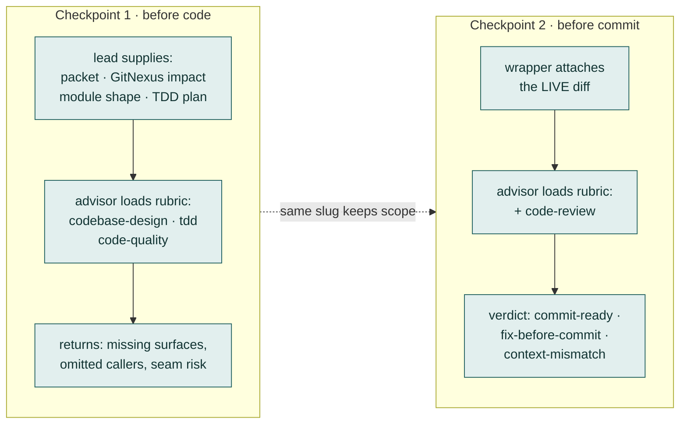
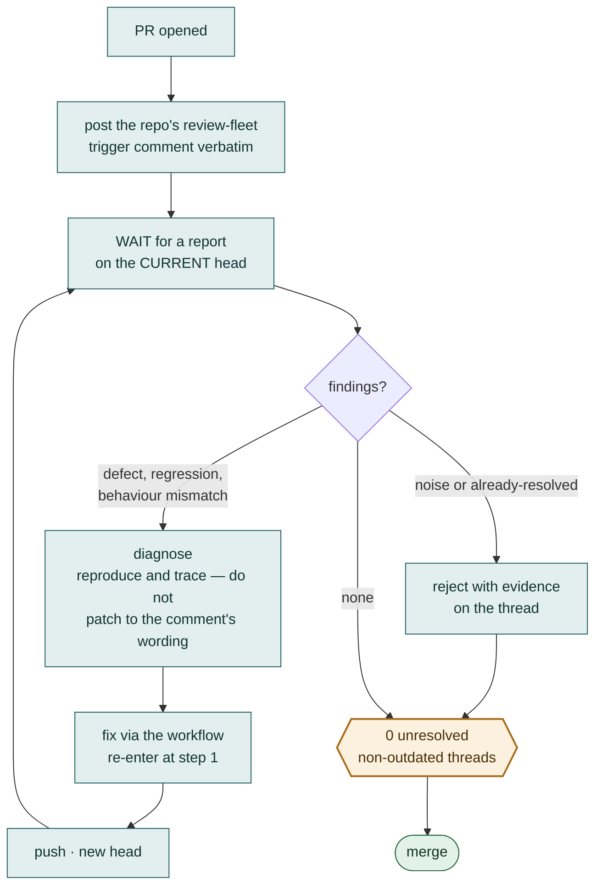

# Repo Production Workflow — Visual Map

A breakdown of the chain every production change runs.

Each named skill is **invoked** with the Skill tool by exact name — reading its
`SKILL.md` does not satisfy the step. Four gates can stop the pass entirely.

> [!NOTE]
> Diagram legend: **amber hexagons** are gates (the pass stops until something
> is proven), **teal boxes** are ordinary steps, **green** is a terminal state.

---

## 1. The chain, end to end

```mermaid
flowchart TD
  A["1 · repo-context-forge<br/>intake packet + bootstrap.py"] --> B{"bug, regression<br/>or perf?"}
  B -- yes --> C["2 · diagnose<br/>reproduce → trace → hypothesis"]
  B -- no --> D
  C --> D["3 · GitNexus packet checks<br/>impact upstream before any edit"]
  D --> E["4 · codex-advisor<br/>phase: preflight-advice<br/>scope challenge"]
  E --> G1{{"GATE 1<br/>scope confirmed,<br/>findings dispositioned"}}
  G1 --> F["5 · production-preflight<br/>surface · invariants · proof plan"]
  F --> G2{{"GATE 2<br/>no blocking<br/>openQuestions"}}
  G2 --> H["6a · tdd<br/>failing test at a REAL seam"]
  H --> I["6b · production-code<br/>smallest correct change"]
  I --> J["7 · verification<br/>tests · bundled gate · detect_changes"]
  J --> K["8 · code-review<br/>Standards axis + Spec axis"]
  K --> L["9 · codex-advisor<br/>phase: precommit-challenge<br/>diff challenge"]
  L --> G3{{"GATE 3<br/>verdict is<br/>commit-ready"}}
  G3 --> M["10 · commit → push → PR<br/>trigger the review fleet"]
  M --> N["11 · reviewer completion gate"]
  N --> G4{{"GATE 4<br/>0 unresolved<br/>non-outdated threads"}}
  G4 --> DONE(["pass complete"])

  classDef gate fill:#fbf1de,stroke:#a86c17,color:#4a3008,stroke-width:2px
  classDef step fill:#e2efee,stroke:#20605f,color:#123433
  classDef done fill:#e3f2e8,stroke:#2c6b46,color:#123420
  class G1,G2,G3,G4 gate
  class A,C,D,E,F,H,I,J,K,L,M,N step
  class DONE done
```

---

## 2. What invokes what

Three different mechanisms. Confusing them is the most common way a pass
silently skips a step.

| Step | Invoke | Mechanism |
| :--- | :--- | :--- |
| **1** | `repo-context-forge` | Skill tool, then `bootstrap.py` via Bash — no slash command |
| **2** | `diagnose` | Skill tool · bugs, regressions, perf only |
| **3** | GitNexus packet checks | `mcp__gitnexus__*` MCP tools |
| **4** | `codex-advisor` | Skill tool → `ask-codex-advisor.sh` wrapper via Bash |
| **5** | `production-preflight` | Skill tool |
| **6** | `tdd` then `production-code` | Skill tool, in that order |
| **7** | verification | repo test/lint/build · bundled gate · `detect_changes` |
| **8** | `code-review` | Skill tool |
| **9** | `codex-advisor` | same wrapper, same `--slug`, phase `precommit-challenge` |

---

## 3. Two independent review checkpoints

The advisor is a Codex model reviewing Claude's work. The lead agent supplies
the evidence; the advisor critiques it and never regenerates it.

**Transport rules**

- **One sanctioned path.** The bundled wrapper via Bash, run in the background
  with stdout and stderr to separate files, never wrapped in `timeout`. Never
  the plugin forwarder — it silently retries hung handoffs every 5–8 minutes.
- **Zero bytes is normal.** Consults buffer and run 2–15 minutes. An in-flight
  run writes nothing. Success needs exit 0, non-empty stdout, *and* the
  terminal marker `codex_advisor_complete`.
- **Depth is not per-consult.** Reasoning effort comes from
  `settings.json → effortLevel` and is stamped into every request. A
  per-consult override would be decorative.

---

## 4. Rules that fail the pass

> [!WARNING]
> **Fake tests are a hard violation, not a judgement call.** A test that mocks,
> stubs, or fixture-substitutes a collaborator instead of crossing a real
> production seam is not proof. If the real seam cannot be driven, that is a
> finding to report — not a licence to substitute.

> [!WARNING]
> **Undemonstrated risk is a report line, never code.** No guard, fallback,
> retry, or config for a failure nobody has observed. Theoretical edge cases
> get written down, not built.

| Gate | Rule |
| :--- | :--- |
| **1 · Scope before preflight** | Preflight does not start until the scope consult returns and its findings are dispositioned. |
| **2 · Red before green** | For behaviour changes the failing test comes first and must be watched failing. Skipping is allowed only for genuinely non-behavioural diffs, and must be stated. |
| **3 · Challenge before commit** | Non-trivial diffs need the challenge round before any commit, push, or PR update. |
| **4 · Reviewers before done** | Push is not completion. Zero unresolved non-outdated threads on the *current* head, or the work is not finished. |

---

## 5. The reviewer loop

A PR that is never triggered is never reviewed — and an untriggered PR can look
gate-clean while nobody has looked at it.

---

## 6. When this is the wrong workflow

- **Multi-PR work** — anything spanning several PRs, needing a tracked
  governing artifact, or exceeding the review budget goes through
  `repo-large-implementation` first, then returns here for each execution pass.
- **Documentation only** — skips Repo Context Forge and GitNexus, but
  governance docs that change agent behaviour still run `code-review`.
- **Every new pass** — a new PR slice, bug fix, or review-fix round re-enters
  at step 1. Compaction or a resume note never waives re-invocation.

---

*Source of truth is [`SKILL.md`](SKILL.md) in this directory; this map is a
visual restatement of it, not a second contract. If they disagree, `SKILL.md`
wins and this file is the defect.*
